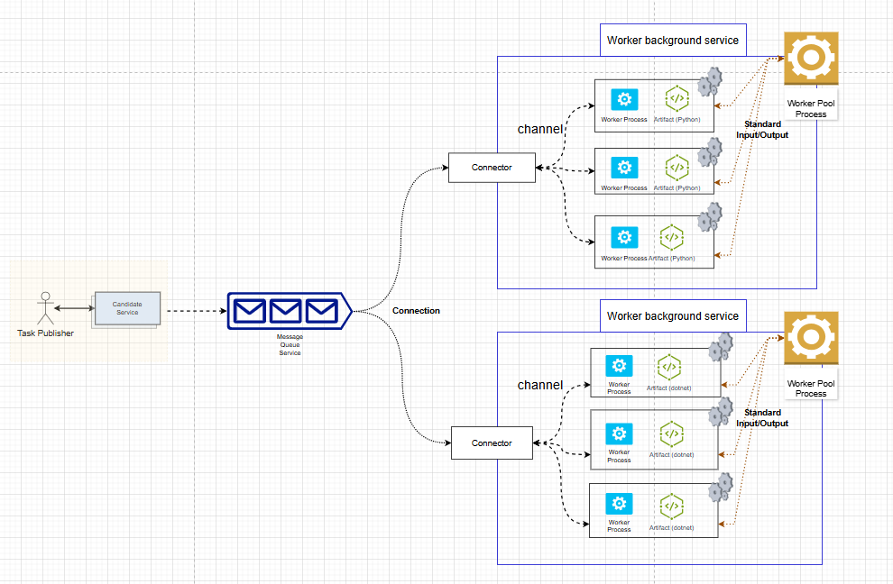

# MessageWorkerPool

[](LICENSE)
[](https://www.nuget.org/packages/MessageWorkerPool/)
[](https://www.nuget.org/packages/MessageWorkerPool/)
[](https://github.com/isdaniel/MessageWorkerPool/actions/workflows/dotnet_build.yml)
[](https://github.com/isdaniel/MessageWorkerPool/actions/workflows/integration_test.yml)
[](https://codecov.io/gh/isdaniel/MessageWorkerPool)

## Introduction

`MessageWorkerPool` is a C# library designed to efficiently manage a pool of worker processes. It seamlessly integrates with message queue services to process messages in a decoupled, scalable, and configurable manner. This library excels in handling tasks within multi-process environments, especially for applications demanding high throughput and low latency. It also supports graceful shutdown, ensuring a smooth process termination without disrupting ongoing tasks.

## Why Process Pool rather than Thread Pool?

Use a process pool when you need robust isolation to prevent issues in one task from affecting others, especially for critical or crash-prone operations,although thread pool would be more lightweight (as threads share memory and require less context-switching overhead), however Process Pool would provide more flexibility solution by implement different program language.

## Installation

To install the `MessageWorkerPool` package, use the following NuGet command:

```sh
PM > Install-Package MessageWorkerPool
```

For OpenTelemetry support, also install:

```sh
PM > Install-Package MessageWorkerPool.OpenTelemetry
```

To install from source, clone the repository and build the project:

```
git clone https://github.com/isdaniel/MessageWorkerPool.git
cd MessageWorkerPool
dotnet build
```

## NuGet Packages

This project provides two NuGet packages:

- **MessageWorkerPool**: Core library for managing worker process pools with RabbitMQ and Kafka integration
- **MessageWorkerPool.OpenTelemetry**: OpenTelemetry extensions for distributed tracing and metrics collection


## Architecture overview



## Dependency third-party Nuget package

* [MessagePack](https://github.com/MessagePack-CSharp/MessagePack-CSharp) : Extremely Fast MessagePack Serializer.
* [rabbitmq-dotnet-client](https://github.com/rabbitmq/rabbitmq-dotnet-client) : RabbitMQ C# client.
* [Confluent.Kafka](https://github.com/confluentinc/confluent-kafka-dotnet) : Kafka C# client.
* [OpenTelemetry](https://github.com/open-telemetry/opentelemetry-dotnet) : OpenTelemetry .NET implementation for distributed tracing and metrics.

## Quick Start

Here's a quick start guide for deploying your RabbitMQ and related services using the provided `docker-compose.yml` file and environment variables from `.env`.

```
docker-compose --env-file .\env\.env up --build -d
```

### Access the Services

1. **RabbitMQ Management Dashboard**: Open `http://localhost:15672` in your browser.
   * Username: guest
   * Password: guest
2. **OrleansDashboard**: Open `http://localhost:8899`
   * Username: admin
   * Password: test.123
3. **Prometheus Metrics**: Open `http://localhost:9090` for metrics exploration
4. **Jaeger Tracing UI**: Open `http://localhost:16686` for distributed tracing visualization
5. **MessageWorkerPool Metrics**: Exposed at `http://localhost:9464/metrics` for Prometheus scraping

### Environment Configuration

The system uses environment variables defined in `./env/.env` file. Key configurations include:

**RabbitMQ Configuration:**
```properties
RABBITMQ_HOSTNAME=rabbitmq-server
QUEUENAME=worker-queue
RABBITMQ_PORT=5672
```

**OpenTelemetry Configuration:**
```properties
OTEL_EXPORTER_OTLP_ENDPOINT=http://otel-collector:4317
OTEL_EXPORTER_OTLP_PROTOCOL=grpc
OTEL_SERVICE_NAME=MessageWorkerPool
OTEL_SERVICE_VERSION=1.0.0
OTEL_RESOURCE_ATTRIBUTES=service.namespace=messageworkerpool,deployment.environment=docker-compose
```

These environment variables configure the OpenTelemetry integration for metrics and distributed tracing.

### Monitoring Stack

The docker-compose setup includes a complete monitoring stack:

- **OpenTelemetry Collector**: Receives, processes, and exports telemetry data
  - OTLP gRPC receiver: `http://localhost:4317`
  - OTLP HTTP receiver: `http://localhost:4318`
  - Prometheus exporter: `http://localhost:8889/metrics`

- **Prometheus**: Time-series database for metrics storage
  - Web UI: `http://localhost:9090`
  - Scrapes metrics from MessageWorkerPool and OpenTelemetry Collector

- **Jaeger**: Distributed tracing backend
  - UI: `http://localhost:16686`
  - Collector endpoint: `http://localhost:14268`

### Available Metrics

MessageWorkerPool exposes the following metrics:

- **Message Processing Metrics**:
  - `messageworkerpool.tasks.processing`: Current number of tasks being processed
  - `messageworkerpool.tasks.processed.total`: Total number of tasks processed
  - `messageworkerpool.tasks.succeeded`: Successfully processed tasks
  - `messageworkerpool.tasks.failed`: Failed tasks

- **Worker Pool Metrics**:
  - `messageworkerpool.workers.active`: Number of active workers
  - `messageworkerpool.workers.idle`: Number of idle workers

- **Performance Metrics** (when enabled):
  - Runtime instrumentation: GC, thread pool, and memory metrics
  - Process instrumentation: CPU and memory usage

### Telemetry Architecture

The telemetry system uses a provider-based architecture:

1. **TelemetryManager**: Central telemetry coordinator that provides a unified interface
2. **OpenTelemetryProvider**: OpenTelemetry implementation of the telemetry provider
3. **TaskProcessingTelemetry**: AOP-based telemetry wrapper for task processing operations
4. **TraceContextPropagation**: W3C trace context extraction and injection

### Configuration Files

**OpenTelemetry Collector Configuration** (`monitoring/otel-collector-config.yaml`):
- Configures receivers (OTLP gRPC/HTTP)
- Defines processors (batch, resource attributes)
- Sets up exporters (Prometheus, Jaeger, debug)
- Establishes telemetry pipelines for metrics, traces, and logs

**Prometheus Configuration** (`monitoring/prometheus.yml`):
- Scrapes OpenTelemetry Collector at `otel-collector:8889`
- Scrapes MessageWorkerPool application at `workersample:9464`
- Configures scrape intervals and retention policies

## Program Structure

Here is the sample code for creating and configuring a worker pool that interacts with RabbitMQ. Below is a breakdown of its functionality; The worker pool will fetch message from RabbitMQ server depended on your `RabbitMqSetting` setting and sending the message via `Process.StandardInput` to real worker node that created by users.

### RabbitMq example code

```c#
using Microsoft.Extensions.DependencyInjection;
using MessageWorkerPool.RabbitMq;
using MessageWorkerPool.Extensions;
using MessageWorkerPool.OpenTelemetry.Extensions;
using Microsoft.AspNetCore.Builder;
using OpenTelemetry.Exporter;

public class Program
{
    public static async Task Main(string[] args)
    {
        var builder = WebApplication.CreateBuilder(args);

        // Configure logging
        builder.Logging.ClearProviders();
        builder.Logging.AddConsole();

        // Add MessageWorkerPool telemetry with OpenTelemetry
        builder.Services.AddMessageWorkerPoolTelemetry(options =>
        {
            options.ServiceName = "MessageWorkerPool.RabbitMQ.Example";
            options.ServiceVersion = "1.0.0";
            options.EnableRuntimeInstrumentation = true;
            options.EnableProcessInstrumentation = true;

            // Configure metrics with OTLP exporter and Prometheus
            options.ConfigureMetrics = metrics =>
            {
                metrics.AddOtlpExporter(otlpOptions =>
                {
                    otlpOptions.Endpoint = new Uri(Environment.GetEnvironmentVariable("OTEL_EXPORTER_OTLP_ENDPOINT"));
                    otlpOptions.Protocol = OtlpExportProtocol.Grpc;
                });
                metrics.AddPrometheusExporter();
            };

            // Configure tracing with OTLP exporter
            options.ConfigureTracing = tracing =>
            {
                tracing.AddOtlpExporter(otlpOptions =>
                {
                    otlpOptions.Endpoint = new Uri(Environment.GetEnvironmentVariable("OTEL_EXPORTER_OTLP_ENDPOINT"));
                    otlpOptions.Protocol = OtlpExportProtocol.Grpc;
                });
            };
        });

        // Add RabbitMQ Worker Pool
        builder.Services.AddRabbitMqWorkerPool(new RabbitMqSetting
        {
            UserName = Environment.GetEnvironmentVariable("USERNAME") ?? "guest",
            Password = Environment.GetEnvironmentVariable("PASSWORD") ?? "guest",
            HostName = Environment.GetEnvironmentVariable("RABBITMQ_HOSTNAME") ?? "localhost",
            Port = ushort.TryParse(Environment.GetEnvironmentVariable("RABBITMQ_PORT"), out ushort p) ? p : (ushort)5672,
            PrefetchTaskCount = 3
        }, new WorkerPoolSetting()
        {
            WorkerUnitCount = 9,
            CommandLine = "dotnet",
            Arguments = @"./ProcessBin/WorkerProcessSample.dll",
            QueueName = Environment.GetEnvironmentVariable("QUEUENAME") ?? "worker-queue",
        });

        var app = builder.Build();

        // Map Prometheus metrics endpoint
        app.MapPrometheusScrapingEndpoint();

        // Configure URL for metrics endpoint
        app.Urls.Add("http://*:9464");

        await app.RunAsync();
    }
}
```

1. **Scalability**
   - Scaling is achieved by increasing the `WorkerUnitCount` and `PrefetchTaskCount` parameters. `WorkerUnitCount` determines how many worker processes are spawned, while `PrefetchTaskCount` determines how many messages to fetch from RabbitMQ at the same time.

2. **Decoupling**
   - RabbitMQ acts as a message broker, decoupling the producers of messages from the consumers (workers). This makes it easier to manage workloads independently.

3. **Configurable**
   - The `RabbitMqSetting` object provides flexibility to modify connection settings, queue names, and worker pool details without changing the code.

4. **Reusable Workers**
   - Worker processes are defined by the `CommandLine` and `Arguments`, making it easy to reuse or swap out the tasks performed by the workers.

5. **Observability**
   - OpenTelemetry integration provides comprehensive monitoring through distributed tracing and metrics collection, enabling real-time visibility into worker pool performance and message processing workflows.

### Kafka example code

The `KafkaSetting<T>` is responsible for kafka setting, `ConsumerConfig` pull information from topic, `ProducerConfig` for worker send reply-queue setting (Please specify `ReplyTo` key/value from message header)

Here are header setting framework support when we use kafka workerpool.

* ReplyTo: worker send reply-queue setting that used for rpc and reply-queue pattern.
* CorrelationId: message CorrelationId.

```c#
public static async Task Main(string[] args)
{
   var builder = CreateHostBuilder(args);
   AddKafkaWorkerPool(builder);
   builder.Build().Run();
}

private static void AddKafkaWorkerPool(IHostBuilder builder)
{
   builder.AddKafkaMqWorkerPool(new KafkaSetting<Null>()
   {
      ProducerCfg = new ProducerConfig()
      {
            BootstrapServers = EnvironmentVAR.HOSTNAME,
            Acks = Acks.All,
            EnableIdempotence = true,
            BatchSize = 32 * 1024
      },
      ConsumerCfg = new ConsumerConfig()
      {
            BootstrapServers = EnvironmentVAR.HOSTNAME,
            GroupId = EnvironmentVAR.GROUPID,
            AutoOffsetReset = AutoOffsetReset.Earliest,
            EnableAutoCommit = false
      },
   }, new WorkerPoolSetting[]{
               new WorkerPoolSetting()
               {
                  WorkerUnitCount = 1,
                  CommandLine = "dotnet",
                  Arguments = @"./BalanceWorkerApp/WorkerProcessor.dll" ,
                  QueueName = Environment.GetEnvironmentVariable("BALANCEWORKER_QUEUE")
               },
               new WorkerPoolSetting()
               {
                  WorkerUnitCount = 4,
                  CommandLine = "dotnet",
                  Arguments = @"./FibonacciWorkerApp/RPC_FibonacciWorker.dll" ,
                  QueueName = Environment.GetEnvironmentVariable("FIBONACCI_QUEUE") ?? "integrationTesting_fibonacciQ"
               },
               new WorkerPoolSetting()
               {
                  WorkerUnitCount = 4,
                  CommandLine = "dotnet",
                  Arguments = @"./LongRunningTaskWorkerApp/LongRunningTaskWorker.dll",
                  QueueName = Environment.GetEnvironmentVariable("LONGRUNNINGBATCHTASK_QUEUE")
               },
            });
}
```

## Protocol between worker and task process

The Protocol between worker and task process are use MessagePack binary format with faster and smaller data transfer, standardInput will send signal control worker process.

In the beginning, worker pool will pass NamedPipe name through standardInput, therefore worker program would need to receive that name and establish NamedPipe between worker process and worker pool.

### Operation command from worker pool

Currently, worker pool will send operations signal or command to worker process via standardInput.

* CLOSED_SIGNAL (`__quit__`): that represent worker pool sent a close or shutdown signal to worker process, that worker process should perform graceful shutdown as soon as possible.

### Data transfer via (Data Named Pipe Stream)

Named pipes are a powerful interprocess communication (IPC) mechanism that allows two or more processes to communicate with each other, even if they are running on different machines in a network (on platforms that support it, like Windows), our workers used to this for trasfering data between worker process and worker pool

[msgpack](https://msgpack.org/) protocols data type support as below class & `byte[]` format.

The corresponding `byte[]` data is:

```
[132,161,48,179,78,101,119,32,79,117,116,80,117,116,32,77,101,115,115,97,103,101,33,161,49,204,200,161,50,129,164,116,101,115,116,167,116,101,115,116,118,97,108,161,51,169,116,101,115,116,81,117,101,117,101]
```

To represent the provided pseudo-JSON structure using the `MsgPack` format (byte[]), we can break down the process as follows:

```json
{
    "0": "New OutPut Message!",
    "1": 200,
    "2": {
        "test": "testval"
    },
    "3": "testQueue"
}
```

More information you can use [msgpack-converter](https://ref45638.github.io/msgpack-converter/) to decode and encode.


## MessageOutputTask Documentation

`MessageOutputTask` is a class designed to encapsulate messages from a Message Queue (MQ) service. It uses MessagePack for efficient serialization.

### Class Properties

| Property | Type | Key | Description |
|----------|------|-----|-------------|
| `Message` | `string` | 0 | Contains the output message from the process |
| `Status` | `MessageStatus` | 1 | Indicates the processing status of the message |
| `Headers` | `IDictionary<string, string>` | 2 | Stores reply information for continued message execution |
| `ReplyQueueName` | `string` | 3 | Specifies the reply queue name (defaults to BasicProperties.Reply) |

### Message Status Values

The `Status` property can have the following values:

| Status | Value | Description |
|--------|-------|-------------|
| `IGNORE_MESSAGE` | -1 | Message should be ignored |
| `MESSAGE_DONE` | 200 | Message processing completed |
| `MESSAGE_DONE_WITH_REPLY` | 201 | Message processed and requires a reply |

* IGNORE_MESSAGE (-1) : Append the message to data steaming pipeline without further processing.
  - `Status = -1`: task process tell worker this isn't a response nor ack message, only feedback to data steaming pipeline.

* MESSAGE_DONE (200) : Notify the worker that this case can be acknowledged by the message queue service.
  - `Status = 200` task process tell worker the task can be acked that mean it was finished.

* MESSAGE_DONE_WITH_REPLY (201) : Please ensure we satisfied below steps for supporting RPC.
   1. The client side cdoe must provide `ReplyTo` information.
   2. task process will use the `Message` column in the JSON payload to reply with the queue information.
   3. Here is an example: When `Status = 201` is sent via data steaming pipeline, the task process instructs the worker to output, such as `1010`, which must then be sent to the reply queue.

```c#
 /// <summary>
/// Encapsulate message from MQ service
/// </summary>
[MessagePackObject]
public class MessageOutputTask
{
   /// <summary>
   /// Output message from process
   /// </summary>
   [Key("0")]
   public string Message { get; set; }
   [Key("1")]
   public MessageStatus Status { get; set; }
   /// <summary>
   /// Reply information that we want to store for continue execution message.
   /// </summary>
   [Key("2")]
   [MessagePackFormatter(typeof(PrimitiveObjectResolver))]
   public IDictionary<string, object> Headers { get; set; }
   /// <summary>
   /// Default use BasicProperties.Reply To queue name, task processor can overwrite reply queue name.
   /// </summary>
   /// <value>Default use BasicProperties.Reply</value>
   [Key("3")]
   public string ReplyQueueName { get; set; }
}
```

## MessageInputTask Documentation

`MessageInputTask` is a class designed to encapsulate incoming messages from a Message Queue (MQ) service. It uses MessagePack for serialization.

### Class Properties

| Property | Type | Key | Description |
|----------|------|-----|-------------|
| `Message` | `string` | 0 | Contains the task body/payload |
| `CorrelationId` | `string` | 1 | Unique identifier for tracking messages between producer and consumer |
| `OriginalQueueName` | `string` | 2 | Name of the queue from which the message originated |
| `Headers` | `IDictionary<string, string>` | 3 | Additional message metadata and configuration |

### Headers Configuration

The `Headers` dictionary can contain various configuration values, including:
- `TimeoutMilliseconds`: Specifies the processing timeout
  - Default value: -1
  - Negative values: Represents infinite timeout
  - Positive values: Timeout in milliseconds

```c#
/// <summary>
/// Encapsulate message from MQ service
/// </summary>
[MessagePackObject]
public class MessageInputTask
{
   /// <summary>
   /// Task body
   /// </summary>
   [Key("0")]
   public string Message { get;  set; }
   /// <summary>
   /// Message CorrelationId for debugging issue between, producer and consumer
   /// </summary>
   [Key("1")]
   public string CorrelationId { get;  set; }
   /// <summary>
   /// Original sending Queue Name
   /// </summary>
   [Key("2")]
   public string OriginalQueueName { get;  set; }
   /// <summary>
   /// TimeoutMilliseconds : The time span to wait before canceling this (milliseconds),
   /// default: -1, if value smaller than 0 represent InfiniteTimeSpan, otherwise use the setting positive value.
   /// </summary>
   [Key("3")]
   [MessagePackFormatter(typeof(PrimitiveObjectResolver))]
   public IDictionary<string, object> Headers { get; set; }
}
```

### MessagePack example data

Example `byte[]` data

```
[130, 161, 48, 179, 78, 101, 119, 32, 79, 117, 116, 80, 117, 116, 32, 77, 101, 115, 115, 97, 103, 101, 33, 161, 49, 204, 200]
```

Correspondence JSON from `byte[]`

```json
{
    "0": "New OutPut Message!",
    "1": 200
}
```

We can write our own worker by different program language (I have provided python and .net sample in this repository).

### How do we handle long-running task or the task involves processing a lot of data rows?

the concept like OS processing thread occurs a context switch (interrupt ..etc).

Client can send a value `TimeoutMilliseconds` via Header: The time span to wait before canceling this (milliseconds), if the task execute exceed the value work process could use that value for setting
interrupt like `Cancellationtoken`.

For example the `MessageOutputTask` JSON could look like below, `status=201` represents that this message will be re-queued for processing next time, the message will bring the `Headers` information when requeue again.

```
{
  "Message": "This is Mock Json Data",
  "Status": 201,
  "Headers": {
    "CreateTimestamp": "2025-01-01T14:35:00Z",
    "PreviousProcessingTimestamp": "2025-01-01T14:40:00Z",
	"Source": "OrderProcessingService",
    "PreviousExecutedRows": 123,
    "RequeueTimes": 3
  }
}
```

## Contributing Guidelines

1. **Fork the Repository**: Start by forking the project repository to your github account.
2. **Clone Locally**: Clone the forked repository to your local machine using a git client.
   ```sh
   git clone https://github.com/isdaniel/MessageWorkerPool
   ```
3. **Create a New Branch**: Always work on a new branch, giving it a descriptive name.
   ```sh
   git checkout -b new-feature-x
   ```
4. **Make Your Changes**: Develop and test your changes locally.
5. **Commit Your Changes**: Commit with a clear message describing your updates.
   ```sh
   git commit -m 'Implemented new feature x.'
   ```
6. **Push to github**: Push the changes to your forked repository.
   ```sh
   git push origin new-feature-x
   ```
7. **Submit a Pull Request**: Create a PR against the original project repository. Clearly describe the changes and their motivations.
8. **Review**: Once your PR is reviewed and approved, it will be merged into the main branch. Congratulations on your contribution!
</details>

<details closed>
<summary>Contributor Graph</summary>
<br>
<p align="left">
   <a href="https://github.com/isdaniel/MessageWorkerPool/graphs/contributors">
      
   </a>
</p>
</details>
---
