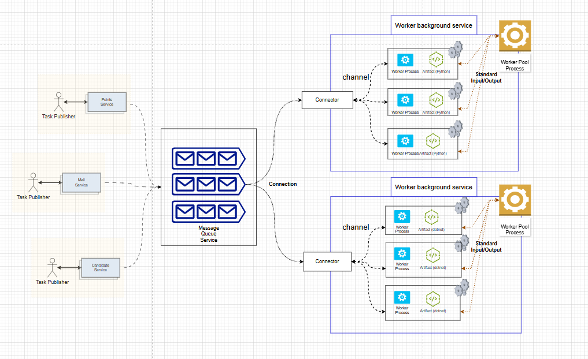

# MessageWorkerPool

[](LICENSE)
[](https://www.nuget.org/packages/MessageWorkerPool/)
[](https://www.nuget.org/packages/MessageWorkerPool/)
[](https://github.com/isdaniel/MessageWorkerPool/actions/workflows/dotnet_build.yml)
[](https://github.com/isdaniel/MessageWorkerPool/actions/workflows/integration_test.yml)

## Introduction

`MessageWorkerPool` is a C# library designed to efficiently manage a pool of worker processes. It seamlessly integrates with message queue services to process messages in a decoupled, scalable, and configurable manner. This library excels in handling tasks within multi-process environments, especially for applications demanding high throughput and low latency. It also supports graceful shutdown, ensuring a smooth process termination without disrupting ongoing tasks.

## Why Process Pool rather than Thread Pool?

Use a process pool when you need robust isolation to prevent issues in one task from affecting others, especially for critical or crash-prone operations,although thread pool would be more lightweight (as threads share memory and require less context-switching overhead), however Process Pool would provide more flexibility solution by implement different program language.

## Installation

To install the `MessageWorkerPool` package, use the following NuGet command:

```sh
PM > Install-Package MessageWorkerPool
```

To install the library, clone the repository and build the project:

```
git clone https://github.com/isdaniel/MessageWorkerPool.git
cd MessageWorkerPool
dotnet build
```

## Architecture overview



## Dependency third-party Nuget package

* [MessagePack](https://github.com/MessagePack-CSharp/MessagePack-CSharp) : Extremely Fast MessagePack Serializer.
* [rabbitmq-dotnet-client](https://github.com/rabbitmq/rabbitmq-dotnet-client) : rabbitMq c# client.

## Quick Start

Here’s a quick start guide for deploying your RabbitMQ and related services using the provided `docker-compose.yml` file and environment variables from `.env`.

```
docker-compose --env-file .\env\.env up --build -d
```

1. Check RabbitMQ health status: Open `http://localhost:8888` in your browser to access the RabbitMQ Management Dashboard.
  * Username: guest
  * Password: guest
2. Check OrleansDashboard `http://localhost:8899`
  * Username: admin
  * Password: test.123

## Program Structure

Here is the sample code for creating and configuring a worker pool that interacts with RabbitMQ. Below is a breakdown of its functionality; The worker pool will fetch message from RabbitMQ server depended on your `RabbitMqSetting` setting and sending the message via `Process.StandardInput` to real worker node that created by users.

```c#
public class Program
{
    public static async Task Main(string[] args)
    {
        CreateHostBuilder(args).Build().Run();
    }

    public static IHostBuilder CreateHostBuilder(string[] args) =>
        Host.CreateDefaultBuilder(args)
            .ConfigureLogging(logging =>
            {
                logging.ClearProviders();
                logging.AddConsole(options => {
                    options.FormatterName = ConsoleFormatterNames.Simple;
                });
                logging.Services.Configure<SimpleConsoleFormatterOptions>(options => {
                    options.IncludeScopes = true;
                    options.TimestampFormat = " yyyy-MM-dd HH:mm:ss ";
                });
            }).AddRabbitMqWorkerPool(new RabbitMqSetting
            {
                UserName = Environment.GetEnvironmentVariable("USERNAME") ?? "guest",
                Password = Environment.GetEnvironmentVariable("PASSWORD") ?? "guest",
                HostName = Environment.GetEnvironmentVariable("RABBITMQ_HOSTNAME"),
                Port = ushort.TryParse(Environment.GetEnvironmentVariable("RABBITMQ_PORT"), out ushort p) ? p : (ushort) 5672,
                PrefetchTaskCount = 3
            }, new WorkerPoolSetting() { WorkerUnitCount = 9, CommandLine = "dotnet", Arguments = @"./ProcessBin/WorkerProcessSample.dll", QueueName = Environment.GetEnvironmentVariable("QUEUENAME"), }
            );

}
```

1. **Scalability**
   - Scaling is achieved by increasing the `WorkerUnitCount` & `PrefetchTaskCount` determined how many amount of fetching message from rabbitMQ at same time.

2. **Decoupling**
   - RabbitMQ acts as a message broker, decoupling the producers of messages from the consumers (workers). This makes it easier to manage workloads independently.

3. **Configurable**
   - The `RabbitMqSetting` object provides flexibility to modify connection settings, queue names, and worker pool details without changing the code.

4. **Reusable Workers**
   - Worker processes are defined by the `CommandLine` and `Arguments`, making it easy to reuse or swap out the tasks performed by the workers.

## Protocol between worker and task process

The Protocol between worker and task process are use MessagePack binary format with faster and smaller data transfer, standardInput will send signal control worker process.

### Worker & worker pool protocol

[msgpack](https://msgpack.org/) protocols data type support as below class & `byte[]` format.

The corresponding `byte[]` data is:

```
[132,161,48,179,78,101,119,32,79,117,116,80,117,116,32,77,101,115,115,97,103,101,33,161,49,204,200,161,50,129,164,116,101,115,116,167,116,101,115,116,118,97,108,161,51,169,116,101,115,116,81,117,101,117,101]
```

To represent the provided pseudo-JSON structure using the `MsgPack` format (byte[]), we can break down the process as follows:

```json
{
    "0": "New OutPut Message!",
    "1": 200,
    "2": {
        "test": "testval"
    },
    "3": "testQueue"
}
```

More information you can use [msgpack-converter](https://ref45638.github.io/msgpack-converter/) to decode and encode.

```c#
 /// <summary>
/// Encapsulate message from MQ service
/// </summary>
[MessagePackObject]
public class MessageOutputTask
{
   /// <summary>
   /// Output message from process
   /// </summary>
   [Key("0")]
   public string Message { get; set; }
   [Key("1")]
   public MessageStatus Status { get; set; }
   /// <summary>
   /// Reply information that we want to store for continue execution message.
   /// </summary>
   [Key("2")]
   [MessagePackFormatter(typeof(PrimitiveObjectResolver))]
   public IDictionary<string, object> Headers { get; set; }
   /// <summary>
   /// Default use BasicProperties.Reply To queue name, task processor can overwrite reply queue name.
   /// </summary>
   /// <value>Default use BasicProperties.Reply</value>
   [Key("3")]
   public string ReplyQueueName { get; set; }
}
```

```c#
/// <summary>
/// Encapsulate message from MQ service
/// </summary>
[MessagePackObject]
public class MessageInputTask
{
   /// <summary>
   /// Task body
   /// </summary>
   [Key("0")]
   public string Message { get;  set; }
   /// <summary>
   /// Message CorrelationId for debugging issue between, producer and consumer
   /// </summary>
   [Key("1")]
   public string CorrelationId { get;  set; }
   /// <summary>
   /// Original sending Queue Name
   /// </summary>
   [Key("2")]
   public string OriginalQueueName { get;  set; }
   /// <summary>
   /// TimeoutMilliseconds : The time span to wait before canceling this (milliseconds),
   /// default: -1, if value smaller than 0 represent InfiniteTimeSpan, otherwise use the setting positive value.
   /// </summary>
   [Key("3")]
   [MessagePackFormatter(typeof(PrimitiveObjectResolver))]
   public IDictionary<string, object> Headers { get; set; }
}
```


Currently, there are some status represnt `MessageStatus`

* IGNORE_MESSAGE (-1) : Append the message to the standard output without further processing.
  - `Status = -1` via Standard Output, task process tell worker this isn't a response nor ack message, only for record via Standard Output.

* MESSAGE_DONE (200) : Notify the worker that this case can be acknowledged by the message queue service.
  - `Status = 200` via Standard Output, task process tell worker the task can be acked that mean it was finished.

* MESSAGE_DONE_WITH_REPLY (201) : Please ensure we satisfied below steps for supporting RPC.
   1. The client side cdoe must provide `ReplyTo` information.
   2. task process will use the `Message` column in the JSON payload to reply with the queue information.
   3. Here is an example: When `Status = 201` is sent via Standard Output, the task process instructs the worker to output the task's JSON Message, such as 1010, which must then be sent to the reply queue.

```json
{"Message":1010,"Status":201}
```

We can write our own worker by different program language (I have provided python and .net sample in this repository).

### How do we handle long-running task or the task involves processing a lot of data rows?

the concept like OS processing thread occurs a context switch (interrupt ..etc).

Client can send a value `TimeoutMilliseconds` via Header: The time span to wait before canceling this (milliseconds), if the task execute exceed the value work process could use that value for setting
interrupt like `Cancellationtoken`.

For example the `MessageOutputTask` JSON could look like below, `status=201` represents that this message will be re-queued for processing next time, the message will bring the `Headers` information when requeue again.

```
{
  "Message": "This is Mock Json Data",
  "Status": 201,
  "Headers": {
    "CreateTimestamp": "2025-01-01T14:35:00Z",
    "PreviousProcessingTimestamp": "2025-01-01T14:40:00Z",
	"Source": "OrderProcessingService",
    "PreviousExecutedRows": 123,
    "RequeueTimes": 3
  }
}
```

## Contributing Guidelines

1. **Fork the Repository**: Start by forking the project repository to your github account.
2. **Clone Locally**: Clone the forked repository to your local machine using a git client.
   ```sh
   git clone https://github.com/isdaniel/MessageWorkerPool
   ```
3. **Create a New Branch**: Always work on a new branch, giving it a descriptive name.
   ```sh
   git checkout -b new-feature-x
   ```
4. **Make Your Changes**: Develop and test your changes locally.
5. **Commit Your Changes**: Commit with a clear message describing your updates.
   ```sh
   git commit -m 'Implemented new feature x.'
   ```
6. **Push to github**: Push the changes to your forked repository.
   ```sh
   git push origin new-feature-x
   ```
7. **Submit a Pull Request**: Create a PR against the original project repository. Clearly describe the changes and their motivations.
8. **Review**: Once your PR is reviewed and approved, it will be merged into the main branch. Congratulations on your contribution!
</details>

<details closed>
<summary>Contributor Graph</summary>
<br>
<p align="left">
   <a href="https://github.com/isdaniel/MessageWorkerPool/graphs/contributors">
      
   </a>
</p>
</details>

---
